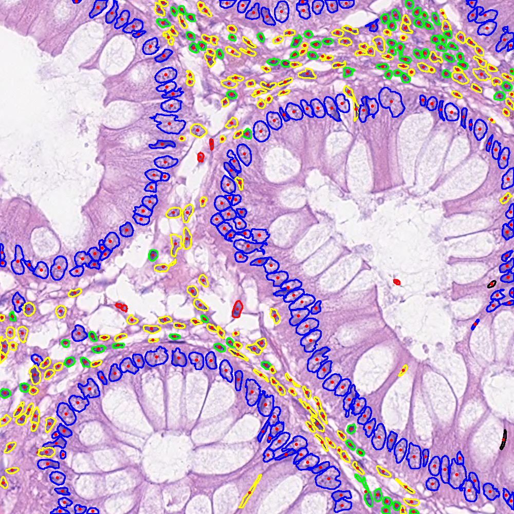

# Sonnet_pytorch
## Overview
This is the pytorch implementation of SONNET. Official SONNET repo (tensorflow) is [here](https://github.com/QuIIL/Sonnet/).
This repository is ready to do:
- Download Datasets employed in the SONNET paper.
- Training and inference task of only segmentation / simultaneous segmentation and classification. <br />
The inference will evaluate with nuclei segmentation metrics (DICE, AJI, DQ, SQ, PQ) and 
nuclei classification metrics (Fd and F1 scores). <br /> And pre-trained weights about simultaneous segmentation and classification task on CoNSeP and GLySAC will be provided.

## Installation


```
conda env create -f environment.yml
conda activate sonnet
pip install torch=2.0.1 torchvision=0.15.2 
```

## Dataset
Download the CoNSeP dataset from this [link](https://warwick.ac.uk/fac/sci/dcs/research/tia/data/hovernet/). <br />
Download the PanNuke dataset from this [link](https://warwick.ac.uk/fac/cross_fac/tia/data/pannuke) <br />
Download the MoNuSAC and GLySAC from this [link](https://drive.google.com/drive/folders/1p0Yt2w8MTcaZJU3bdh0fAtTrPWin1-zb?usp=sharing) <br />
And add **`dataset`** folder under the project as below:
```
Sonnet_pytorch
│   README.md
│   requirements.txt    
│
└───dataset
│   └───CoNSeP 
│       └───Train
│       └───Test
│   └───GLySAC 
│       └───Train
│       └───Test
```

## Instruction
## Training
### Step 1: Prepare the patches by execute
**`python extract_patches.py`** <br /><br />
For only instance segmentation, patches are stored as 4 dimensional numpy array with channels [RGB, inst, ordinal]. <br />
For simultaneous instance segmentation and classification, patches are stored as 5 dimensional numpy array with channels [RGB, inst, type, ordinal]. <br /> 
Here, inst is segmentation ground truth. I.e pixels range from 0 to N, where 0 is background and N is the number of nuclear instances for that particular image. <br /> 
Type is the ground truth of the nuclear type. I.e every pixel ranges from 0-T, where 0 is background and T is the number of classes.<br /> 
Ordinal is the ground truth of ordinal labels of 1-K, For each nuclei, we draw K concentric circles using the center of mass as a common center. I.e every pixel ranges from 1-K, where 1 denotes the outermost layer and K denotes the innermost layer.<br /> 


Before training:

- Set cropped train and valid path to the data directories in `config.py`
- Set dataset_name (consep or glysac) in `config.py`
- Maybe you need to modify hyperparameters, including number of epochs/learning rate/batch size in `models/hovernet/opt.py`.

### Step 2: Training the model
The encoder is an EfficientNet_b0 and here we directly used the PyTorch reimplementation by [lukemelas](https://github.com/lukemelas/EfficientNet-PyTorch)
with the pretrained encoder weights which would be downloaded from online automatically once you start to train.

To initialise the training script with GPUs 0 and 1, the command is:
```
python run_train.py --gpu='0,1' 
```

### Step 3: Inference the model

#### Model Weights

Segmentation and classification pretrained weights:
- [CoNSeP checkpoint](https://drive.google.com/file/d/1J6j5bimIyEA9gkW-fUzDzV8xFxMCOgTu/view?usp=drive_link)
- [GLySAC checkpoint](https://drive.google.com/file/d/1J6j5bimIyEA9gkW-fUzDzV8xFxMCOgTu/view?usp=drive_link)
#### Usage
Firstly you might want to download the pretrained weights under the directory of pretrain as below:
```
Sonnet_pytorch
│   README.md
│   requirements.txt    
│
└───dataset
│   └───CoNSeP 
│       └───Train
│       └───Test
│   └───GLySAC 
│       └───Train
│       └───Test
└───pretrain 
│       sonnet_consep_type_pytorch.tar
│       sonnet_glysac_type_pytorch.tar
```
And set the parameters as below: <br />
```
  python run_infer.py \
        --gpu='0' \
        --nr_types=5 \
        --type_info_path=type_info.json \
        --batch_size=32 \
        --model_path=./pretrain/sonnet_consep_type_pytorch.tar \
        tile \
        --input_dir=./dataset/CoNSeP/Test/Images/ \
        --output_dir=./test_output/ 
```
### Step 4: Calculate the metrics
```
python compute_stats.py 
```

## Overlaid Segmentation and Classification Prediction

## Visual Results
<table border="0">
<tr>
    <td>
    
    </td> 
    <td>
     
    </td>
</tr>
</table>

Overlaid results trained on the CoNSeP dataset. The colour of the nuclear boundary denotes the type of nucleus. <br />
Blue: epithelial<br />
Red: miscellaneous <br />
Green: spindle-shaped <br />
Yellow: inflammatory

## Comparison to Original TensorFlow Implementation

Below we report the difference in simultaneous segmentation and classification results trained using this repository (PyTorch) and the results reported in the original manuscript (TensorFlow). 

Segmentation results on the CoNSeP dataset:
| Platform   | DICE       | PQ         | SQ          | DQ          | AJI         |
| -----------| -----------| -----------| ------------| ------------| ------------|
| TensorFlow | 0.844      | 0.698      | 0.772       |0.540        |0.586        |
| PyTorch    | 0.830      | 0.657      | 0.754       |0.497        |0.556        |

Classification results on CoNSeP dataset: 
| Platform   | F1         | Miscellaneous| Inflammatory| Epithelial  | Spindle     |
| -----------|------------| -------------| ------------| ------------| ------------|
| TensorFlow | 0.778      |     0.465    |    0.659    |    0.662    |   0.597     |
| PyTorch    | 0.750      |     0.400    |    0.608    |    0.635    |   0.557     |

Segmentation results on the GLySAC dataset:
| Platform   | DICE       | PQ         | SQ          | DQ          | AJI         |
| -----------| -----------| -----------| ------------| ------------| ------------|
| TensorFlow | 0.838      | 0.648      | 0.796       |0.811        |0.672        |
| PyTorch    | 0.824      | 0.621      | 0.778       |0.794        |0.648        |

Classification results on GLySAC dataset: 
| Platform   | F1         | Miscellaneous| Lymphocyte  | Epithelial  |
| -----------|------------| ------------ | ------------| ------------|
| TensorFlow | 0.864      |     0.360    |    0.559    |    0.557    |
| PyTorch    | 0.854      |     0.304    |    0.530    |    0.556    |


## References
**[1]** Graham, Simon and Vu, Quoc Dang and Raza, Shan E Ahmed and Azam, Ayesha and Tsang, Yee Wah and Kwak, Jin Tae and Rajpoot, Nasir. "Hover-net: Simultaneous segmentation and classification of nuclei in multi-tissue histology images." arXiv:1812.06499(2019) <br/>
**[2]** T. N. N. Doan, B. Song, T. T. L. Vuong, K. Kim and J. T. Kwak, "SONNET: A Self-Guided Ordinal Regression Neural Network for Segmentation and Classification of Nuclei in Large-Scale Multi-Tissue Histology Images," in IEEE Journal of Biomedical and Health Informatics, vol. 26, no. 7, pp. 3218-3228, July 2022, doi: 10.1109/JBHI.2022.3149936.

